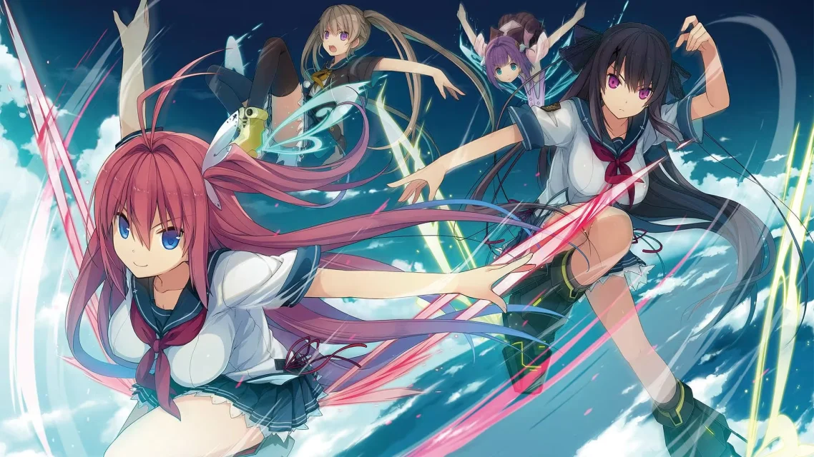
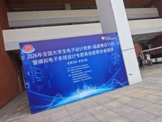
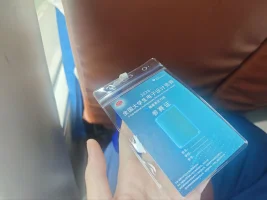

*写于 2026 年 7 月 18 日，赛后补记。*

## 备赛：从苍彼借来飞翔的勇气

> 随风挥动的翅膀，呼唤我飞向天空  
> 轻抚大家的鸟儿，划出洁白的弧线  
> 今天一定能比昨天飞得更高  
> 我深吸一口气抬头向上望去，你对我说没问题  
> 扑面而来的风，夏天里的坚强  
> 此刻我全都能紧紧握在手中！！
>
> ——Beyond the sky, into the firmament

我也向往着有像 Galgame 里面一般的经历，而现在，我正一点一点地将它变为现实。

一直非常喜欢日本的 Galgame。里面总是洋溢着一种非常青春、很有活力的感觉，带给我无限的希望，也总是让我热血沸腾。遇到问题就想尽一切办法去解决，为了自己喜欢的东西认真地拼一次，这样的故事我真的看不腻。

我也一直觉得，为自己热爱的东西而奋斗，哪怕献出生命也是可以的。emm……有种“朝闻道”的感觉？写出来可能有一点中二，但那份想要全力以赴的心情，确实是真的。

最近在备战电子设计竞赛。不知道为什么，总是会被**《苍之彼方的四重奏》**里的人物、剧情和音乐感染。看着她们一点点克服困难，我也会想：我也想这样，我能做到。

**我想拿省一。**这句话，我已经无数次对自己说过了。

苍彼也成了我备赛时最大的动力。每次听到「夢の音が聞こえる，ほら君の胸ん中からさ，汗がしみ込む翼ひらけ！」，就又想继续往前试一试。游戏里的那片天空，居然真的给现实中的我带来了这么多力量。

我会尽目前最大的能力，把这个比赛做到最好，即便前方是血与泪。不过嘛，就像 Galgame 里面的理念一样，我也觉得一定要快乐。向着这个目标冲刺的时候，我也是快乐的。

我终究是凡人，但是会拼尽全力。

**就从低空出发吧！飞往高远的天空。**

---

## 赛后：四天三夜，终于结束了

备赛时写下这些话的时候，比赛还在前面。后来，真的走完了那四天三夜，再回头看，才知道“拼尽全力”落到自己身上是什么感觉。

比赛结束后，我发了这样一条说说：

> 结束了……电赛，四天三夜，已经累得没办法说话了，一共就睡了 14 小时，高强度工作 70 小时。接下来……只能祈祷了。

那时候确实已经没什么力气组织语言了。备赛时有好多热血的话想说，等到真正结束，反而只剩下“终于结束了”这一个念头。

能做的已经尽力做了，接下来就只能等结果。前面一直想着怎么往前冲，到了这个时候，才终于能停下来喘口气。

把这两张照片也放在这里吧。没有游戏里那么辽阔的天空，就是比赛现场、手里的证件，还有一个已经累得说不出话的自己。但这也是属于我的夏天，值得好好留下来。

## 后记：那个念叨了无数次的省一

结果出来了，**省一等奖！**

备赛时一遍遍对自己说的“我想拿省一”，终于变成了“我拿到省一了”。现在再看 7 月 18 日写下的这些话，还是会觉得很感慨。原来当时有点中二、又很认真的愿望，真的可以一点一点变成现实。

从前玩 Galgame，总是向往里面那种为了一个目标拼尽全力的经历。这次我也有了一段自己的故事。有热血，有疲惫，有结束后只能祈祷的不安，最后也等到了想要的结果。

谢谢苍彼，陪我走过了这个夏天。以后再听到这些音乐，应该也会想起这次电赛，想起那个一边说着“我能做到”，一边努力往前飞的自己吧。

就从低空出发吧。还想继续飞往更高、更远的天空。
