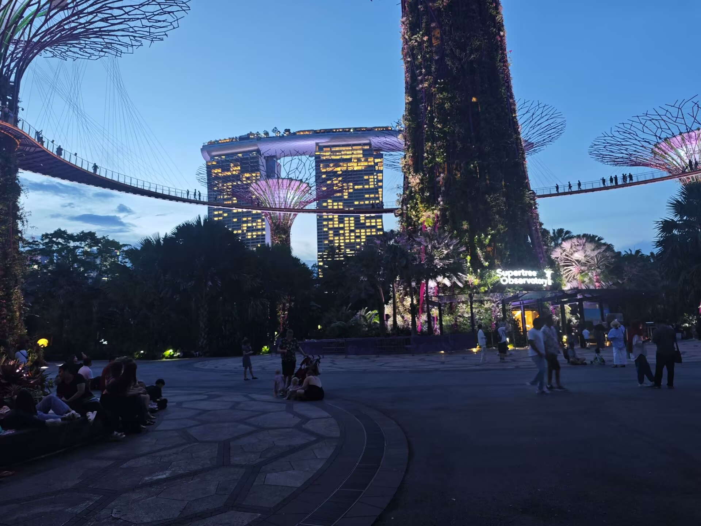

我去到了常夏的狮城——新加坡。这里不仅是花园城市，更是 **《可塑性记忆》（Plastic Memories）** 中那段令人心碎又温暖的爱情见证地。

## 邂逅：不期而遇的连城街

旅行的第一站是**连城街（Liang Seah Street）**。有趣的是，刚踏上这条街时我并未意识到身处圣地，只觉得南洋风情浓郁。直到随手打开地图对照，才猛然发现这里的建筑线条与动画中如出一辙。这种“差点错过”的恍然大悟，或许正是巡礼中最奇妙的惊喜。

随后，我一路打卡了：

* **鱼尾狮公园 & 金沙湾**：在波光粼粼的湾区，找到了艾拉曾经疯狂购物的商场原型。
* **滨海湾花园（超级树丛）**：这里是整部作品重头戏——**游乐园**的原型。站在高耸入云的“超级树丛”下，思绪瞬间被拉回到离别的那一段剧情。虽然现实中没有摩天轮，但那份科幻与自然交织的氛围，确实像极了 Giftia 们存在的那个近未来世界。

## 狮城观察：多元与秩序的熔炉

比起日本的静谧，新加坡给我的感觉更加复杂且充满活力。

### 1. 城市肌理：中日结合的幻视感

新加坡的结构像是一个**“中日合体版”**。市中心摩天大楼林立，繁华程度直逼北上广；而周边街区则像日本的一户建，只是材质从木材换成了多彩的砖石，还多了个充满南洋气息的小院子。旧街区的建筑则更有东南亚特色，恍惚间总让我觉得走在厦门的中山路上。

### 2. 社会秩序：高效与高素质

* **地铁（MRT）体验**：这里没有安检，刷 Visa 卡即可进出，通行效率极高。看到中车四方制造的列车，长得和厦门地铁一模一样，倍感亲切。
* **文明程度**：地铁上没有人外放手机，上下车严格遵循“先下后上”的秩序。相比之下，国内部分地区的公共场合素质确实还有提升空间。
* **人种大熔炉**：在超级树下，我遇到了来探亲的德国游客，两人用英语聊了许久。这里大约一半人会说中文，但英语依然是通行的“桥梁”。

### 3. 生活细节：奢华与真实的嗅觉

新加坡是一个“冷气给满”的城市，只要是室内，空调永远开得像冰窖。街道虽然不如日本那样一尘不染，但充满了真实的人间烟火味——走在路上，鱼腥味与香水味交织。这里不流行垃圾分类，几户人家共用一个写着门牌号的垃圾桶，这种粗犷与城市的高级感形成了一种独特的反差。

---

## 旅行贴士：物价与天气

* **天气**：新加坡的天气变化极快。我很幸运地避开了所有雷暴，只感受到了云层擦肩而过的凉爽。
* **物价**：发达国家的消费确实不低。正餐基本在 **100元人民币** 左右，相比之下，我吃了三顿的麦当劳简直是“穷游救星”。
* **枢纽**：樟宜机场的**登机口安检模式**极大地提升了舒适度，出入境流程丝滑得让人心情愉悦。

## 结语

如果说《Summer Pockets》是关于重逢的梦，那么《可塑性记忆》在新加坡留下的印记，就是关于“珍惜当下”的注解。即使艾拉的记忆会重置，但我们踏过的每一寸土地、感受到的每一次心跳，都是真实的。

---